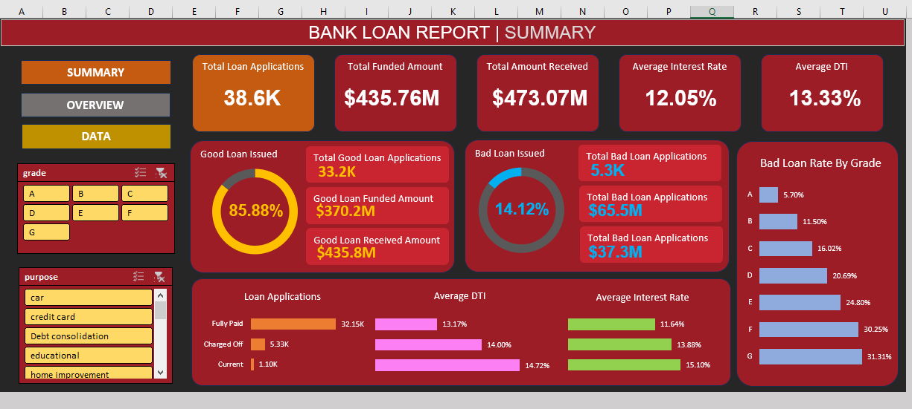
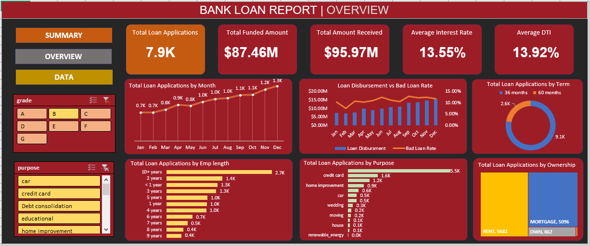

# 📊 Bank Loan Analysis Dashboard

## 📌 Project Overview

This project is a data analysis portfolio project focused on the Finance Domain. It demonstrates how to perform data preparation, analysis, and visualization using Microsoft Excel to derive actionable insights from bank loan data. 

The objective is to analyze loan applications, funded amounts, repayment performance, loan quality, borrower characteristics, and credit risk indicators from the perspective of a lending/financial institution.

The dashboard helps identify **good vs. bad loans, high risk loan grades, loan demand patterns, repayment terms, employment segments, and home ownership categories**.

---

## 🖥️ Dashboard Preview

---

## 🛠️ Key Features

- **Dynamic Dashboards:** Interactive summary, overview, and detailed grid views.
- **KPI Tracking:** Monitoring Total Loan Applications, Total Funded Amounts, and Total Amounts Received.
- **Loan Performance:** Analysis of "Good Loan" vs. "Bad Loan" status using custom conditional logic.
- **Advanced Formatting:** Custom chart designs, slicers for data filtering, and navigation buttons for seamless user experience 

---

## 📊 Project Insights

Based on the analyzed portfolio:

- The dataset contains approximately **38.6K loan applications**.
- The total funded amount is approximately **$435.8M**.
- The total amount received is approximately **$473.1M**.
- The average interest rate is approximately **12%**.
- The average borrower DTI is approximately **13.3%**.
- The majority of loans are classified as **good loans**.
- Charged-off loans represent a significant portion of the portfolio and require additional risk monitoring.
- Higher-risk loan grades show substantially higher bad-loan rates.
- Debt consolidation is one of the largest loan-purpose categories.
- 36-month loans account for a larger share of applications than 60-month loans.
- Bad loans show considerably weaker recovery compared with the amount originally funded.

